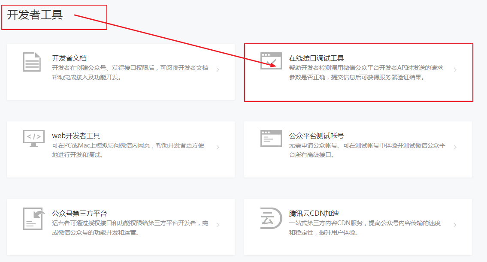
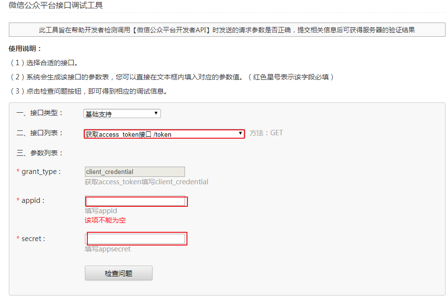
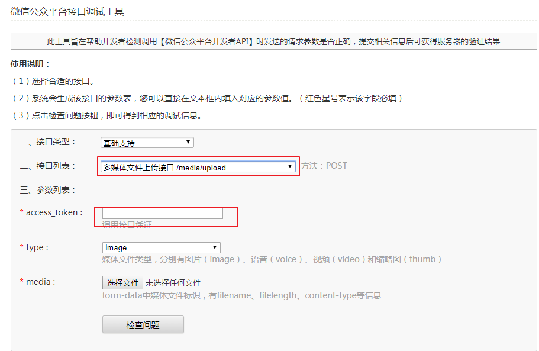

# 微信开发流程（api.php中进行开发）

>在微信开发中，主要用于接收用户的各种关键字进行相应的逻辑处理，比如：签到、抽奖、机器人聊天、自动回复、听歌等功能，都将在此篇中进行体验出来

>首先微信客户端接收用户发送的信息调用微信接口，然后再通过你自己在公众平台上的配置，访问你自己的服务器中的相应的接口，然后将自己写好的分钟逻辑方法，返回到微信客户端，呈现在用户面前，就是微信公众号的工作流程了

### 微信的六大接收接口（xml格式或者json格式）
>文本消息接收接口($this->keyword)
>图片接收接口
>视频和小视频接收接口
>语音接收接口
>地理位置接收接口
>链接接口接收接口(很少用)

#### 通过$this->sendType判断用户上传的类型

>在微信中开发添加exit()是一个特别好的习惯

```php
<?php
error_reporting(E_ALL || ~E_NOTICE);
define("TOKEN", "");
include dirname(__FILE__)."/Lib/WeChatApi.class.php";
include dirname(__FILE__)."/Lib/WeChat.class.php";
class WxApi extends Wechat{

	public function responseMsg(){
		parent::responseMsg();

		if( $this->sendType == "text" ){
			$this -> reText("您上传的是文本消息，我接收的类型是"+$this->sendType);
			exit();
		}else if( $this->sendType == "image" ){
			$this -> reText("您上传的是图片消息，我接收的类型是"+$this->sendType);
			exit();
		}else if( $this->sendType == "video" ){
			$this -> reText("您上传的是视频(小视频)消息，我接收的类型是"+$this->sendType);
			exit();
		}else if( $this->sendType == "voice" ){
			$this -> reText("您上传的是语音消息，我接收的类型是"+$this->sendType);
			exit();
		}else if( $this->sendType == "link" ){
			$this -> reText("您上传的是链接消息，我接收的类型是"+$this->sendType);
			exit();
		}else if( $this->sendType == "location" ){
			$this -> reText("您上传的是地理位置消息，我接收的类型是"+$this->sendType);
			exit();
		}
	}

}

$WxApi = new WxApi();
#注解该代码就开启了自动回复功能
// $WxApi ->valid();
$WxApi -> responseMsg();
```

### 微信回复接口
#### 文本回复接口($this->reText())

>案例一：输入？,获取相应的内容
```php
<?php
error_reporting(E_ALL || ~E_NOTICE);
define("TOKEN", "");
include dirname(__FILE__)."/Lib/WeChatApi.class.php";
include dirname(__FILE__)."/Lib/WeChat.class.php";
class WxApi extends Wechat{

	public function responseMsg(){
		parent::responseMsg();

		if( $this-> keyword =="?" ){
			$content = "【1】火警电话\n【2】防火电话\n【3】报警电话\n【4】我的电话\n";
			$this->reText( $content );
			exit();
		}else if($this-> keyword =="1"){
			$this->reText( "火警电话：119" );
			exit();
		}else if($this-> keyword =="2"){
			$this->reText( "防火电话：111" );
			exit();
		}else if($this-> keyword =="3"){
			$this->reText( "报警电话：110" );
			exit();
		}else if($this-> keyword =="4"){
			$this->reText( "我的电话：112" );
			exit();
		}
	}
}

$WxApi = new WxApi();
#注解该代码就开启了自动回复功能
// $WxApi ->valid();
$WxApi -> responseMsg();
```
>在微信开发中，换行要使用\n,不能使用常见的换行标签

#### 图片回复接口($this->reImage(mediaId))
##### 怎么获取图片的mediaID？
##### 登录微信公众平台，在开发者工具中选择以下选项
>
##### 先获取access_token
>
##### 然后再获取media_id
>

>案例一：输入图片,获取相应的内容
```php
<?php
error_reporting(E_ALL || ~E_NOTICE);
//TOKEN请查看微信公众平台的开发者配置
define("TOKEN", "");
include dirname(__FILE__)."/Lib/WeChatApi.class.php";
include dirname(__FILE__)."/Lib/WeChat.class.php";
class WxApi extends Wechat{

	public function responseMsg(){
		parent::responseMsg();

		if( $this-> keyword=="图片" ){
			$this -> reImages( $mediaId );
		}
	}

}

$WxApi = new WxApi();
#注解该代码就开启了自动回复功能，但是在验证TOKEN阶段必须开启
// $WxApi ->valid();
$WxApi -> responseMsg();
```

#### 音乐回复接口($this->reMusic($title,$desc,$url,$hqurl))
>音乐回复接口同文本回复接口，只是里面的参数，我需要解释一下
##### $title音乐的标题
##### $desc音乐的简介
##### $url音乐的链接地址
##### $hqurl音乐的高品质播放地址(wifi下自动选择这个地址播放)
>案例代码如下：
```php
<?php
error_reporting(E_ALL || ~E_NOTICE);
//TOKEN请查看微信公众平台的开发者配置
define("TOKEN", "");
include dirname(__FILE__)."/Lib/WeChatApi.class.php";
include dirname(__FILE__)."/Lib/WeChat.class.php";
class WxApi extends Wechat{

	public function responseMsg(){
		parent::responseMsg();

		if( $this-> keyword=="来首音乐" ){
			$title = "爱很美";
			$desc = "一首动听的爱情歌曲";
			//下面的地址，使用的是我自己的网站通过七牛云对象存储的歌曲外链
			$url = $hqurl="http://pbbvc4xp2.bkt.clouddn.com/%E7%88%B1%E5%BE%88%E7%BE%8E.mp3";
			$this->reMusic($title,$desc,$url,$hqurl);
			exit();
		}
	}

}

$WxApi = new WxApi();
#注解该代码就开启了自动回复功能，但是在验证TOKEN阶段必须开启
// $WxApi ->valid();
$WxApi -> responseMsg();
```

#### 视频回复接口($this->reVideo($MediaId,$title,$desc))
>音乐回复接口同文本回复接口，只是里面的参数，我需要解释一下
##### $MediaId视频的mediaid，同图片处理方式
##### $title视频标题
##### $desc视频的简介
>代码同音乐部分


#### 语音回复接口($this->Recognition)获取相应的内容
>案例代码如下：
```php
<?php
error_reporting(E_ALL || ~E_NOTICE);
//TOKEN请查看微信公众平台的开发者配置
define("TOKEN", "");
include dirname(__FILE__)."/Lib/WeChatApi.class.php";
include dirname(__FILE__)."/Lib/WeChat.class.php";
class WxApi extends Wechat{

	public function responseMsg(){
		parent::responseMsg();

		if( $this-> sendType=="voice" ){
			$content = $this->Recognition;
			$this->reText("您说的内容是："+$content);
			exit();
		}
	}

}

$WxApi = new WxApi();
#注解该代码就开启了自动回复功能，但是在验证TOKEN阶段必须开启
// $WxApi ->valid();
$WxApi -> responseMsg();
```